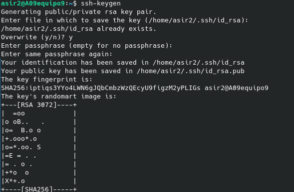
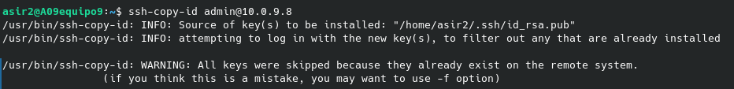
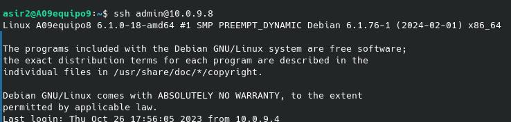
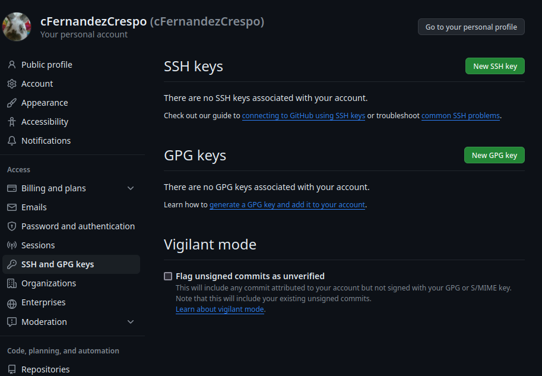
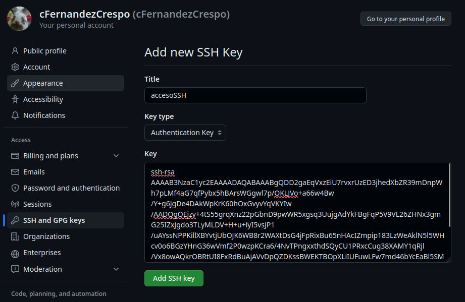

# SSHacceso
<h2>Para realizar una conexión SSH en este caso con un host cuya IP es 10.0.9.8 debemos seguir los siguientes pasos:</h2>

<h4>Desde la máquina destino(10.0.9.8) debemos realizar los siguientes comandos </h4>

*Generamos la clave publica/privada*

~~~ 
ssh-keygen
~~~

<h4>Una vez generada la clave se la asignamos al usuario a nuestra elección. En nuestro caso se la asignaremos al usuario admin(10.0.0.9) con el siguiente comandos </h4>
~~~ 
ssh-copy-id admin@10.0.9.8
~~~

<h4>Ahora desde la máquina origen(10.0.9.9) deberiamos poder establecer conexión sin necesidad de contraseña a la máquina destino(10.0.9.8) </h4>
~~~ 
ssh admin@10.0.9.8
~~~

<h3>2 Configurar el acceso ssh en el GitHub</h3>
<h2> Accedemos a los ajustes en nuestro perfil de GitHub y en el apartado SSH and GPG Keys seleccionamos la opción New SSH Key</h2>

***Una vez dentro asignamos un nombre a nuestra llave y pegamos el contenido de la misma y seleccionamos Add new key

